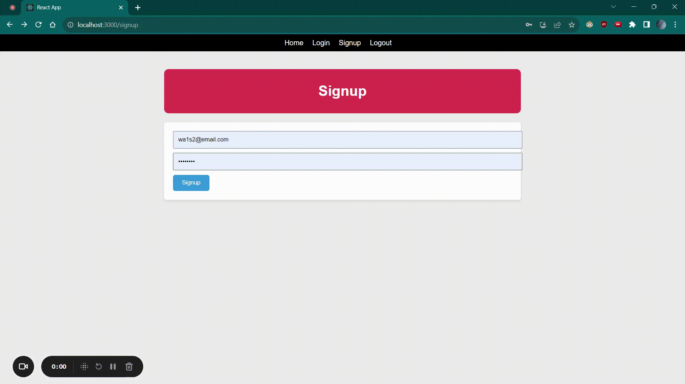

# Notes App

This is a MERN (MongoDB, Express.js, React.js, Node.js) stack application that allows users to manage their notes. Users can sign up, log in, create, update, and delete notes. JWT authentication is used to secure the user's access to the application.

## Features

- **User Authentication**:
  - Users can sign up and log in securely to access the app.

- **Create Notes**:
  - Users can create new notes with a title and content.

- **Update Notes**:
  - Users can edit the title and content of their existing notes.

- **Delete Notes**:
  - Users can delete their notes.

## Technologies Used

- **MongoDB**: NoSQL database for storing notes and user information.
- **Express.js**: Backend framework for handling server and API logic.
- **React.js**: Frontend framework for building the user interface.
- **Node.js**: Runtime environment for executing server-side code.

## Access
- I am yet to deploy this app for users to access. The GIF in this demo shows how the app works.
